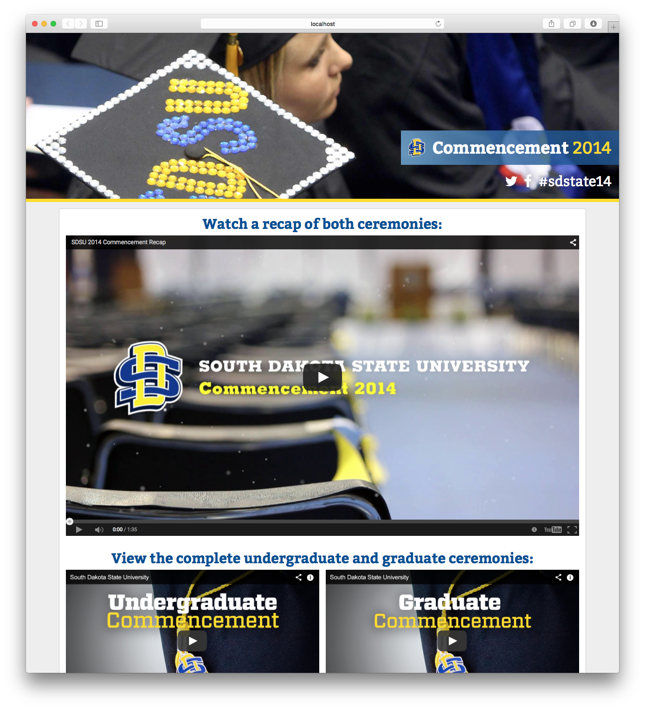

<!-- ## Projects -->

Hello. My name is Erik Ebsen. The following is a collection of things I've built or been a part of building, both for my job as a web developer for South Dakota State University and personal side projects on my own time.

Click an image to view the full site.

> Note: _Maybe try to add a toggle to filter by project type._

Projects for:
<ul>
  <li>South Dakota State</li>
  <li>personal</li>
</ul>

## Personal

### Game Time!

I wanted a super-simple way to keep score at our son's soccer games. This is that thing.

### mkpw

I like Safari's ability to generate and suggest good passwords but I'm not always using Safari. This script produces a random password and copies it to your clipboard. Just run and paste.

### ebsen.me

This website. It changes from time to time.

### Rock-Paper-Scissors

Event handlers in the browser confused me so I wrote a very simple web app to learn more about how they worked.

### Songbook

A little single-page hymnal/web app of sorts for a few of the (public domain) songs we sing on Sundays with the kids. It allowed a good excuse to experiment with Jade, Harp, and Crockford-style JavaScript. It includes the greatest, most beautiful piece of template code ever written (by me).

---

## Professional

### Graduation 2014

A official university landing page to highlight the accomplishments of our graduating bachelors, masters, and Ph.D. students, including live streams of the commencement ceremonies, our own original recap video, and curated Instagram and Twitter posts.

### Graduation 2015

The current iteration of the graduation website adds social media integration through Storify, a music playlist from Spotify, and a Facebook photo album. I also scripted our Git deployment process to make publishing and updating the site much simpler.

### Hobo Day Parade 2014

The website for our first-ever live stream of the annual Hobo Day parade. We used Tagboard for the social media integration and Harp, Jade, and Less to build the website. This project grew into the template we use for many of our future static sites.

### We Are SDState holiday video

At the end of each year, the university publishes a video to highlight the accomplishments made by its faculty and staff. This year, that email campaign also kicked off #WeAreSDState, a campaign to promote the university's value around the region.

### News Center

The News Center represents our team's most significant Drupal site to date and served as a demonstration to the campus community how Drupal could transform how we publish content to the web.

### Agricultural Heritage Museum

A custom-themed WordPress site built from Photoshop designs. I and two student developers prototyped the design using Foundation and Node.js, then converted the resulting code into WordPress. It features a prominent carousel on the homepage and several post types to display information in various places across the site.
